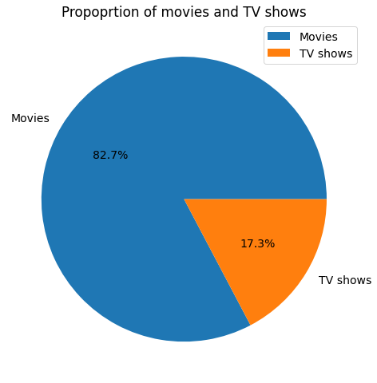
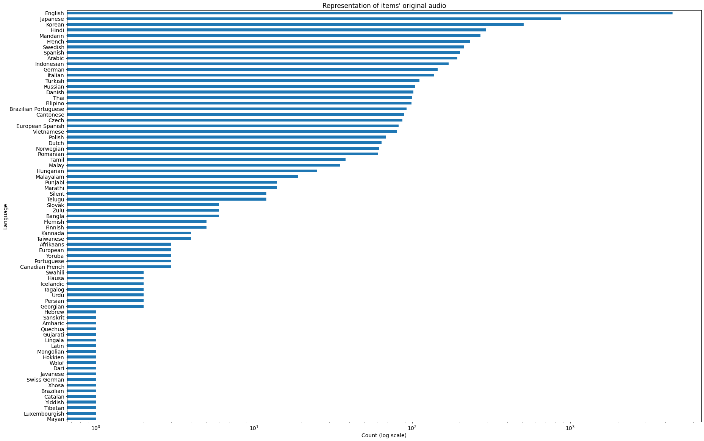
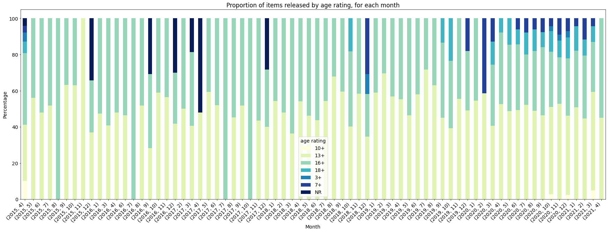
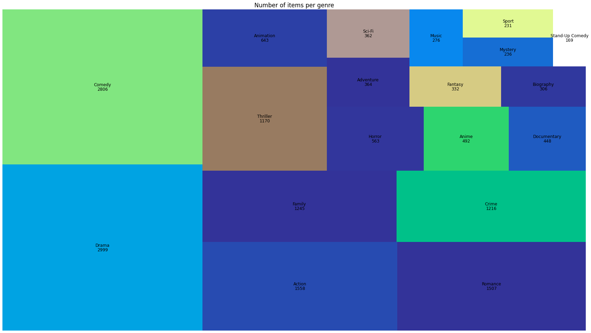
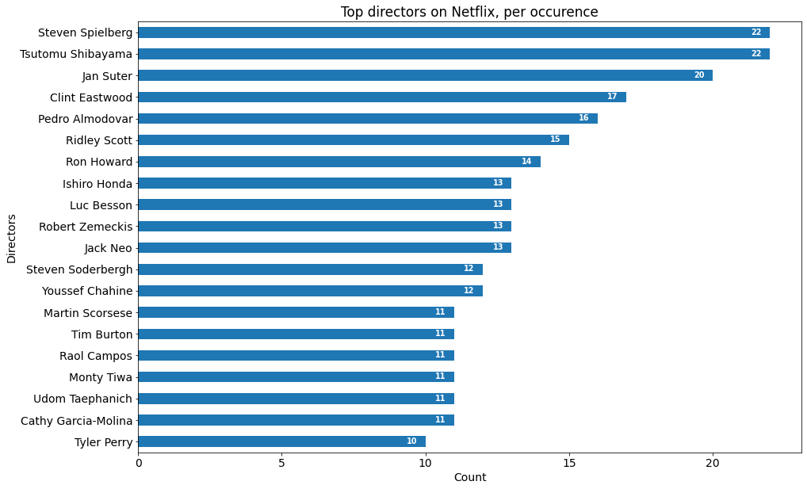
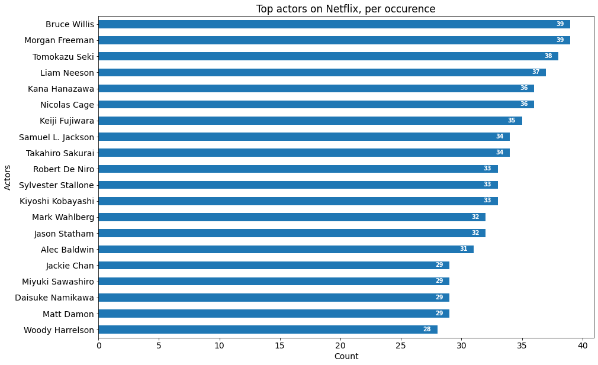
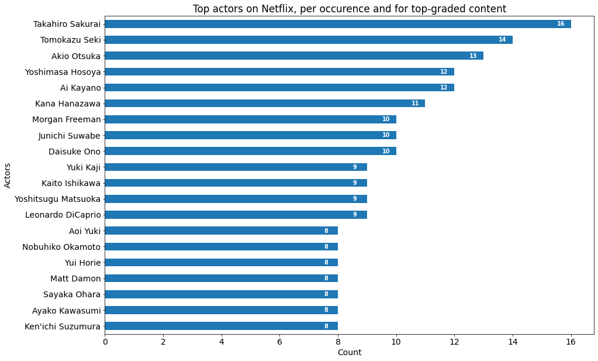
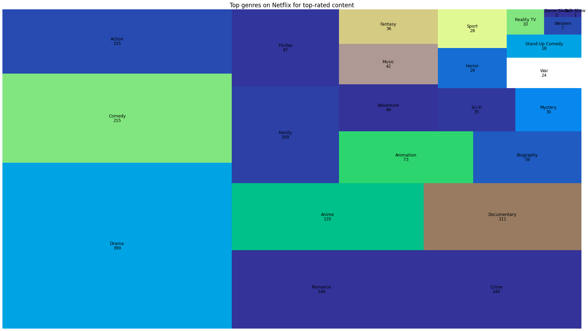
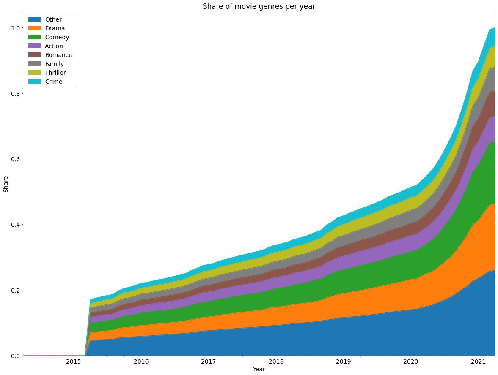
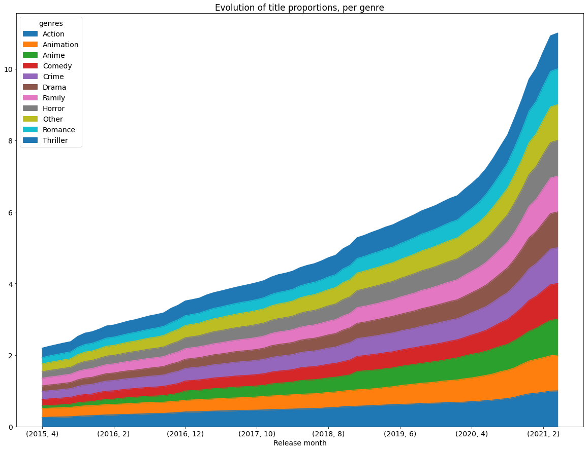

# Milestone 1
## Exploratory Data Analysis

<table border="1" class="dataframe">
  <thead>
    <tr style="text-align: right;">
      <th></th>
      <th>id</th>
      <th>title</th>
      <th>description</th>
      <th>imdb</th>
      <th>metacritic</th>
      <th>duration</th>
      <th>number of seasons</th>
      <th>audio</th>
      <th>family friendly</th>
      <th>age rating</th>
      <th>release date on Netflix</th>
      <th>actual_release_year</th>
      <th>actors</th>
      <th>directors</th>
      <th>countries</th>
      <th>genres</th>
      <th>alternate genres</th>
      <th>month</th>
      <th>year</th>
    </tr>
  </thead>
  <tbody>
    <tr>
      <th>0</th>
      <td>0</td>
      <td>Riding Faith (Hope Ranch)</td>
      <td>Following her father's death, a young woman st...</td>
      <td>4.2</td>
      <td>NaN</td>
      <td>81.0</td>
      <td>NaN</td>
      <td>English</td>
      <td>False</td>
      <td>10+</td>
      <td>2020-06-17</td>
      <td>2020</td>
      <td>[0, 1, 2, 3, 4]</td>
      <td>[5]</td>
      <td>[0, 1, 2, 3, 4, 5, 6, 7, 8, 9, 10, 11, 12, 13,...</td>
      <td>[0, 1]</td>
      <td>[2, 3, 4, 5]</td>
      <td>6</td>
      <td>2020</td>
    </tr>
    <tr>
      <th>1</th>
      <td>1</td>
      <td>Los Rodriguez y el mas alla</td>
      <td>When a young boy finds a message from his late...</td>
      <td>4.6</td>
      <td>NaN</td>
      <td>116.0</td>
      <td>NaN</td>
      <td>European Spanish</td>
      <td>False</td>
      <td>10+</td>
      <td>2020-03-22</td>
      <td>2019</td>
      <td>[6, 7, 8, 9, 10, 11, 12, 13, 14, 15, 16, 17]</td>
      <td>[18]</td>
      <td>[15, 16, 17, 18, 19, 20, 21, 22, 23, 24, 25, 2...</td>
      <td>[6, 1, 7]</td>
      <td>[8, 9, 10, 11, 12, 13, 14, 15, 16, 17, 18]</td>
      <td>3</td>
      <td>2020</td>
    </tr>
    <tr>
      <th>2</th>
      <td>2</td>
      <td>Mauricio Meirelles: Generating Chaos</td>
      <td>Comedian Mauricio Meirelles explores his chaot...</td>
      <td>5.2</td>
      <td>NaN</td>
      <td>63.0</td>
      <td>NaN</td>
      <td>Brazilian Portuguese</td>
      <td>False</td>
      <td>18+</td>
      <td>2020-04-16</td>
      <td>2020</td>
      <td>[19]</td>
      <td>[20]</td>
      <td>[32, 0, 15, 33, 1, 34, 35, 16, 36, 37, 38, 17,...</td>
      <td>[6, 19]</td>
      <td>[11, 20, 21, 22]</td>
      <td>4</td>
      <td>2020</td>
    </tr>
    <tr>
      <th>3</th>
      <td>3</td>
      <td>The Asterisk War</td>
      <td>A 'Genestella' a new breed of powerful human n...</td>
      <td>6.8</td>
      <td>NaN</td>
      <td>NaN</td>
      <td>1.0</td>
      <td>Japanese</td>
      <td>False</td>
      <td>13+</td>
      <td>2018-07-01</td>
      <td>2015</td>
      <td>[21, 22, 23, 24, 25, 26, 27, 28, 29, 30, 31, 32]</td>
      <td>NaN</td>
      <td>[32, 0, 33, 34, 35, 36, 37, 38, 39, 40, 41, 42...</td>
      <td>[23, 24]</td>
      <td>[24, 25, 26, 27, 28]</td>
      <td>7</td>
      <td>2018</td>
    </tr>
    <tr>
      <th>4</th>
      <td>4</td>
      <td>Banana Split</td>
      <td>Despite leaving for college, a heartsick teen ...</td>
      <td>6.2</td>
      <td>63.0</td>
      <td>83.0</td>
      <td>NaN</td>
      <td>English</td>
      <td>False</td>
      <td>16+</td>
      <td>2020-07-26</td>
      <td>2018</td>
      <td>[33, 34, 35, 36, 37, 38, 39, 40]</td>
      <td>[41]</td>
      <td>[2, 13]</td>
      <td>[6]</td>
      <td>[11, 3, 29, 30]</td>
      <td>7</td>
      <td>2020</td>
    </tr>
  </tbody>
</table>

Notice that, in our dataset, a movie have a `duration` in minutes but doesn't have a `number of seasons`. For a TV show it is the opposite, it doesn't have a `duration` but it has a precise `number of seasons`.

### Basic Statistics

    Here are some basic statistics about our data:
    
    --> There are 9113 items of the Netflix catalogue in our data.
    
    --> The content we have was released on Netflix between 2015-04-14 00:00:00 and 2021-04-08 00:00:00.
    
    --> There are 40868 unique actors starring in the Netflix catalogue.
    
    --> There are 5451 unique directors in the Netflix catalogue.
    
    --> Content is classified into 25 genres (and 899 alternative genres) in the Netflix catalogue.
    

### Movies vs. TV shows 

A first interesting statistic to note is the proportion of movies and TV shows available on the streaming platform. Netflix is best-known for TV-shows, but it actually started out as a movie-rental service. There are clearly more movies than TV shows in their current catalogue.

    There are 7538 movies and 1575 TV shows in the dataset.

    

    

### Proportion of content for each age rating

The streaming platform is popular among families, it therefore offers a large variety of content destined to different-aged publics. 

    

    

Netflix offers mostly content aimed towards a public of `+13` and `+16`.

### Number of items per country

In 2010, Netflix decided to expand its operations to a wider range of locations. Today, it is available in more than 190 countries. Naturally, some content is specific to a certain region, depending on language, culture and copyrights. Let's explore the catalogue's size depending on the country.

    

    

### Audio representation in the catalogue

With its expansion, Netflix acquired content rights to match the culture of its newly added regions. Moreover, it recently started to produce its own content, in various languages. Let's explore the representation of each language in Netflix's library.

    There are 73 different languages in our dataset. The 3 most present ones are English, Japanese and Korean.

    

    

### Releases per month

To stay competitive during their expansion, Netflix releases content frequently. Let's explore the amount of content their releases each month since April of 2015.

    

    

### Releases per month, per rating

We have just seen the amount of content they propose on their platform for each month since April 2015. For those same periods of time, let's study what type of user the content is intended for, characterized by the age rating.

    

    

We can observe that Netflix started introducing a lot of content rated as `+18` as well as `+7` at the beginning of the year 2020. Generally, their content is mostly orientated to `+13` and `+16` viewers.

### Number of items per genre

As well as proposing frequent releases for different type of viewers, their content is adapted to different tastes. Let's study the volume of content proposed for each genre.

    

    

Clearly the 2 most represented genres in the streaming platform's library are Drama and Comedy.

### Number of items per genre, per release date

After seeing what are the most popular genres in the entire Netflix catalogue, let's observe how Netflix varies his content over the years.

    

    

### Top directors and top actors bar plots

The streaming platform offers a lot of content from a lot of cultures. Let's see who are the top-20 directors and the top-20 actors, according to the number of content they directed or acted in, respectively, in our dataset.

    

    

    

    

We can observe that for the tops are both quite culturally diverse, even though a lot of the directors and of the actors seems to belong to either an American or an Asian background.

### Most represented actors in top-graded items

Not all content available on Netflix is well rated on online movies and tv shows rating data bases such as IMDb. Let's see if the top-20 actors in the top-1000 rated items in IMDB are the same from the previous plot which was based on occurences.

    

    

Clearly, we can note that the names and the order in the top-20 actors occurrences differs from the previous part. There are more Asian actors in this ranking than in the previous one.

### Most represented genres in top-graded items

We know that the most represented genres in the Netflix's catalogue are Drama and Comedy. Let's see if it is still the case in the top-1000 rated movies according to IMDb.

    

    

Drama and comedy are still the most represented genres, even though the Drama one really dominates all the other genres.

### Cumulative amount of each genre over the years

Netflix's library has grown over the years. Let's see how the diversity of its catalogue has evolved since April 2015.

    

    

    

    

