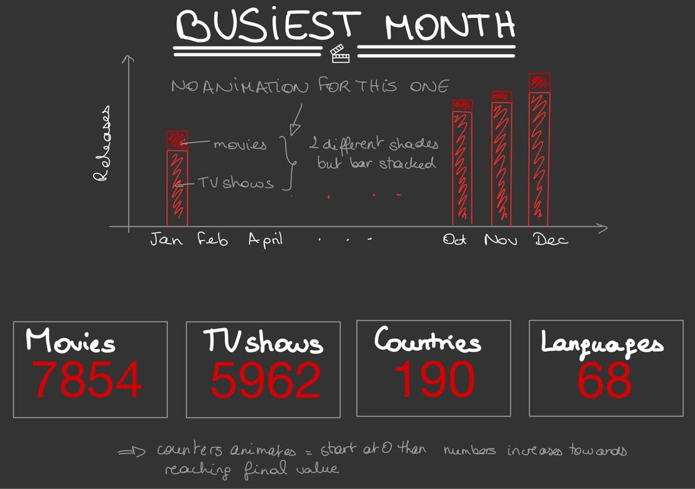
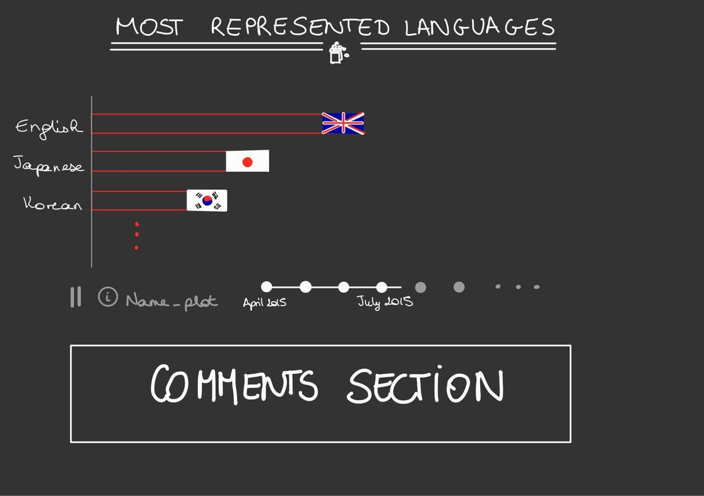
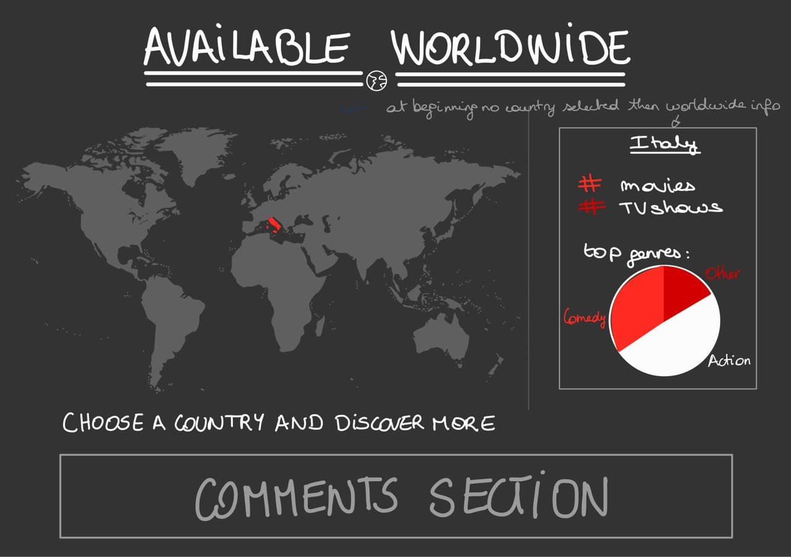
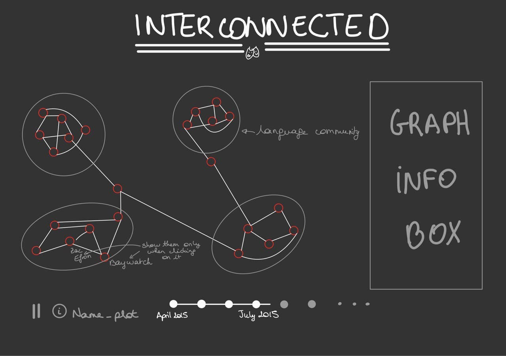
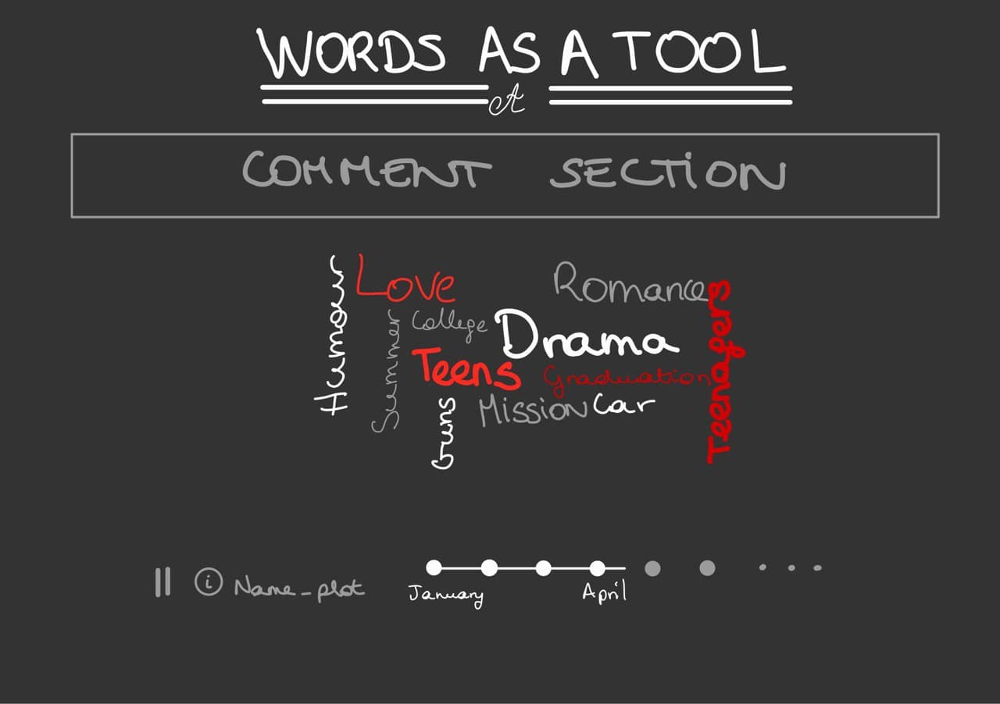
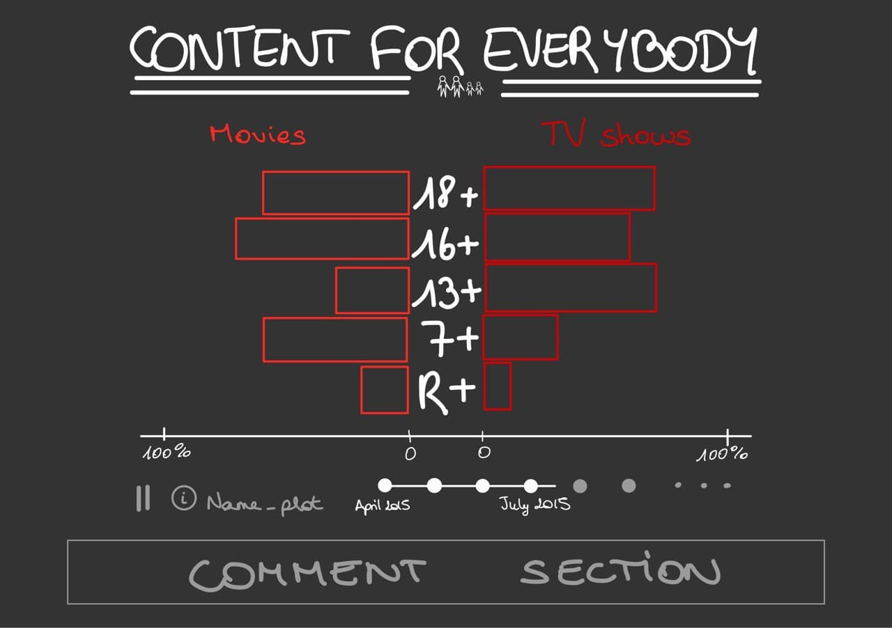
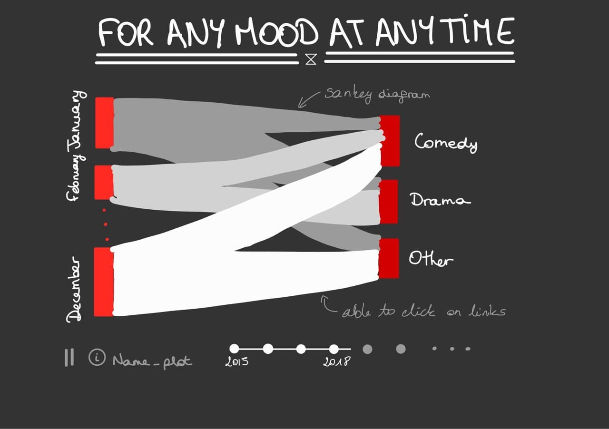
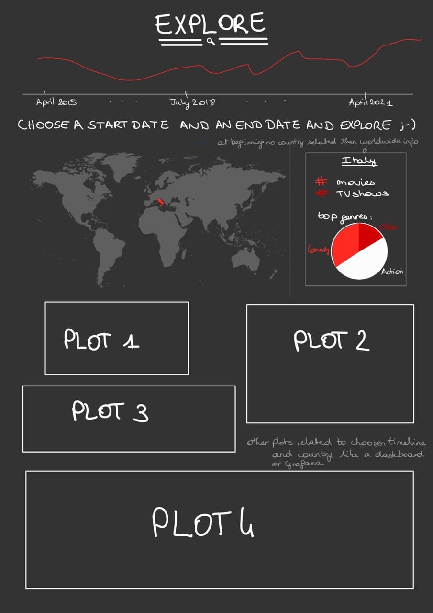

# Milestone 2

Through our visualization, we would like to show how Netflix's release strategy evolved during the last few years. We will first introduce the dataset by showing basic insights about the content, and a first look at Netflix's release trends. We will next dive into the geographical and cultural expansion of the service, and how its library was updated accordingly. We will finally look into the evolution of the content itself, in order to satisfy the demand following the expansion.

## General comments

Generally throughout the project we will require the following lectures, that we will not mention under each visualization:
 - The web development and D3 lectures to build the website and the core of our visualizations, along with the one about designing visualizations.
 - The lecture on tabular data since it is the format our data is represented with. 
 - The lecture on storytelling, since it is important to have a meaningful narrative which answers our problematic in a structured way. 

We will use `gulp` to streamline the website's development and deployment, along with `Babel` and `Sass`. We will also use `Bootstrap` as our main CSS framework, as it provides pre-built components and makes it easy to create responsive designs. To provide a smooth scrolling experience we will use `fullpage.js`. 

Our core visualization consists of all the plots described below, aside from the ones containing maps and graphs. The latter are more complex, and we plan to include them only if time permits. If this is not the case, we can replace the maps by a simpler country selector. 

## Introduction

</img>

As a starter, it is crucial to give some basic but important insight about the data, all while hinting at the aspects we will tackle later on. 

On the first page our website are four animated counters, showing the number of movies and series available on the platform, the number of languages the content is available in, as well as the number of countries the service is accessible from. They count from the first values available, until they reach the latest data point.
> This visualization doesn't require specific tools, other than javascript.

Our problematic brings up the aspect of release trends. On the same page, we will therefore show the repartition of the number of trends across the 12 months. Using stacked bar plots, we will differentiate between movies and series. 
> This visualization requires `D3` for the plot, along with the corresponding lectures (about D3 and interactions). 

## Geographical and cultural expansion

</img>

Following its geographical expansion, Netflix had to start offering content in new languages, to attract new customers in the countries it just launched in. 

We will first display the evolution of the representation of languages in Netflix's content across time. This will be done using an animated horizontal bar plot sorted by most represented language in movies and series. Under the plot, there will be a Netflix-style action bar, where the user can pause/play, restart and navigate through the animation. 
> The tools we will require for this visualization are `D3` and possibly `jQuery`.

  
  

Naturally, what follows the languages are the countries. Netflix is available in more than 190 countries. But most items of its library are region-specific. Hence, we will use an interactive world map that will showcase the number of titles available in each country. A side-box to the right of the map will show general worldwide statistics (number of movies/series, top genres, etc). The user will be able to select a country which will highlight it on the map, and update the side-box with information specific to the selected country. 
> For this interactive visualization, we will need `D3` (and perhaps `leaflet` or something lighter like `canvas`). The lectures on maps will come in handy for this part.

  </img>

  

</img>

Finally, the addition of new content in new countries means the network of actors on the platform grew in size. Can we distinguish language communities by looking at such a network? In this part, we will show a graph where the nodes represent movies, and an edge links two movies if they share a common actor (the more actors they share, the higher the edge weight). Using community detection, we will display the graph in a way that movies are clustered depending on their original language. This graph will be animated as follows: at the start, the network whole is shown, but all the items are grayed-out. As time passes, movies released will lighten-up, and their respective connections too. At the end of the timeline, the whole graph will be visible. Under the visualization, there will be a Netflix-style action bar, where the user can pause/play, restart and navigate through the animation. We are still thinking about proper ways of choosing which nodes to include, to reduce the network's density.  
> We will need `networkX` to build and analyse the graph, then `D3` and a graph visualization tool like `cytoscape` or `sigma`. The lecture about graphs will be needed for this part.

## Content evolution

To meet the growing demand that came following the expansion, Netflix had to adapt their content to keep their new customers. This means that they had to produce and publish content accessible to all groups, in-line with seasonal events, and that matches people's taste.

</img>

It would be interesting to find the most popular topics among movies and series, depending on the time of the year. You don't want to miss cheesy Valentines movies, do you? We will show, using word clouds, the results of topic extraction on the items' description. The plot will be animated over the 12 months, and will show one word cloud at a time. Under the visualization, there will be a Netflix-style action bar, where the user can pause/play, restart and navigate through the animation. 
> For this visualization, we will need `D3` and the `d3-cloud` plugin. The lecture on text visualization will be useful here. 

  
  

</img>

Netflix is a great source of entertainment for teenagers and younger children and should therefore offer content appropriate to their ages. Let's see if Netflix made sure this is the case. In this visualization, we will show the proportion of all content each age rating occupies at a given point in time. Using a bar plot (similar to an age-distribution pyramid plot), we will show this with the movies on one side, and the series on the other. The plot will be animated over time. Under it, there will be a Netflix-style action bar, where the user can pause/play, restart and navigate through the animation. 
> We will need `D3` for this visualization.

  
  

</img>

Finally, we expect Netflix to provide us with content that feeds our craving for spicy Dramas on Tuesday evenings, and our lust for comedies on week-end mornings. The content's genres could also be seasonal. Using a Sankey diagram, we will show the breakdown of content across months and genres. Those diagrams can quickly become cluttered. Therefore, when selecting a month, the visualization will highlight all flow outgoing from that month, into the corresponding genres. Similarly, when selecting a genre, the flow to all the corresponding months will be highlighted. Moreover, the plot will be animated, so that we can visualize differences across years. 
> We will need `D3` and the `d3-sankey` plugin. The lectures on maps and graphs might come in handy in this case.

  

## Exploration tool

After leading the user down our storyline, it's time to set her free, and let her explore the data in the way she likes. Using this tool, users can select a time period and a country, then have access to some visualizations and insights on the data for that time period and country. The tool will be formed of a map (similar to the previous one), and a selectable timeline (with an overlay showing the distribution of releases across time), around which various visualizations will be shown. 

> This plot will require `D3` and a map visualization tool. The lectures about maps will come in handy.

  </img>

